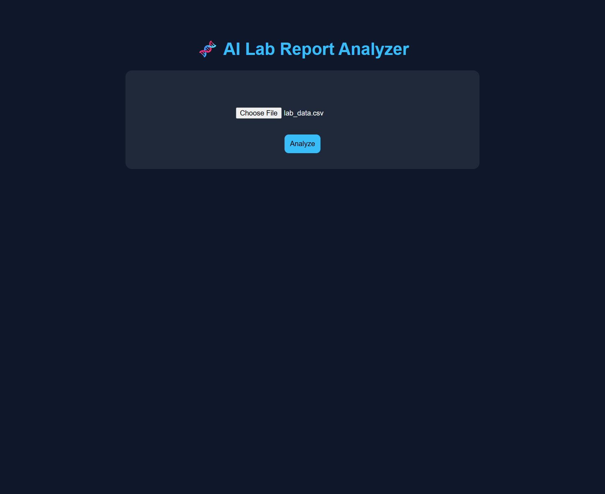
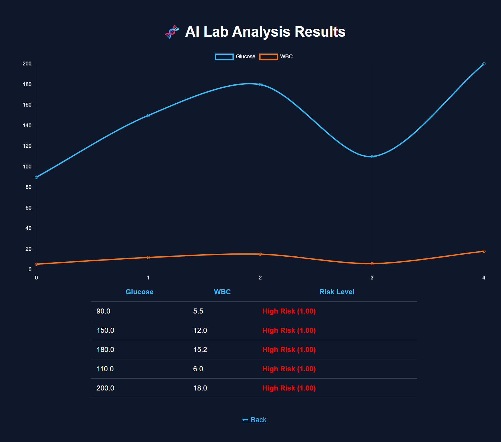

# 🧬 AI Lab Risk Analyzer (GPU-Powered)

An AI-powered healthcare analytics application that analyzes lab data (Glucose, WBC) and predicts patient risk levels using a neural network.

---

## 🚀 Live Demo

### Upload Interface


### Results Dashboard


---

## ⚡ Features

- CSV upload for batch lab analysis
- Real-time AI predictions
- Risk classification:
  - 🟢 Low
  - 🟡 Moderate
  - 🔴 High
- Interactive data visualization (Chart.js)
- GPU acceleration (PyTorch CUDA support)

---

## 🧠 Tech Stack

- FastAPI (Backend)
- PyTorch (Neural Network)
- Pandas (Data Processing)
- Chart.js (Visualization)
- HTML/CSS (UI)

---

## 🏃 Run Locally

```bash
git clone https://github.com/medlabtech2013/ai-lab-risk-analyzer.git
cd ai-lab-risk-analyzer

python -m venv venv
source venv/bin/activate

pip install -r requirements.txt

uvicorn main:app --reload

http://127.0.0.1:8000

## 📊 Example Input

Glucose,WBC
90,5.5
150,12
180,15

##🎯 Future Improvements

Model training with real clinical datasets

FHIR/HL7 integration

Patient dashboard

Cloud deployment (AWS)

##👨‍💻 Author

Branden Bryant
BSIT (AI) | Medical Lab Tech → AI Engineer
GitHub: https://github.com/medlabtech2013
